# 神经网络与深度学习 Project 2 实验报告

**姓名：** 陈展  
**学号：** 22300680044  
**GitHub：** https://github.com/CZcoco/Fdu_DL_2  
**数据集：** CIFAR-10（通过 torchvision 自动下载）  
**模型权重：** https://modelscope.cn/models/growup/FDU-DL-PJ2-Models/files

---

## 一、任务一：在 CIFAR-10 上训练网络（60%）

### 1.1 实验环境

- GPU: NVIDIA GeForce RTX 4090 D
- 框架: PyTorch 2.x + torchvision
- 数据集: CIFAR-10（60000 张 32×32 彩色图像，10 类）
- 数据增强: RandomCrop(32, padding=4) + RandomHorizontalFlip
- 训练轮数: 30 epochs
- Batch Size: 128

### 1.2 数据集概览

CIFAR-10 包含 10 个类别：飞机、汽车、鸟、猫、鹿、狗、青蛙、马、船、卡车。每类 6000 张图像，训练集 50000 张，测试集 10000 张。

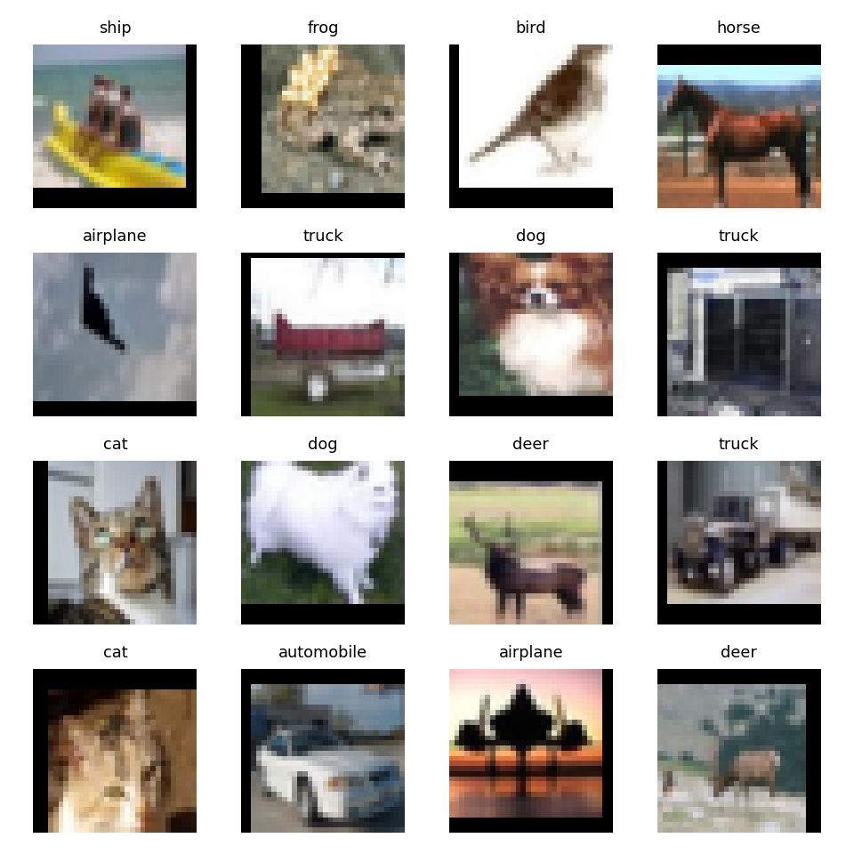

### 1.3 网络结构设计

我实现了 5 种不同的网络结构进行对比：

| 模型 | 结构特点 | 参数量 |
|------|---------|--------|
| VGG_A | 标准 VGG-A（8 层卷积 + 3 层全连接） | 9.75M |
| VGG_A_BatchNorm | VGG-A + 每层卷积后加 BN | 9.76M |
| VGG_A_Dropout | VGG-A + 全连接层 Dropout(0.5) | 9.75M |
| VGG_A_Light | 轻量版（2 层卷积，16/32 通道） | 285K |
| ResNet_Small | ResNet-18 风格（残差连接 + BN） | 11.17M |

所有模型均包含项目要求的基本组件：
- **全连接层（FC）**：分类器部分
- **2D 卷积层**：特征提取
- **2D 池化层**：MaxPool2d 下采样
- **激活函数**：ReLU（默认）

额外组件：
- **Batch Normalization**：VGG_A_BatchNorm, ResNet_Small
- **Dropout**：VGG_A_Dropout
- **残差连接（Residual Connection）**：ResNet_Small

权重初始化统一使用 Xavier Normal 方法。

### 1.4 架构对比实验

#### 实验设置

由于不同架构对学习率的敏感度不同，我为每个模型选择了合适的优化器和学习率：

- VGG_A: SGD (lr=0.01, momentum=0.9)
- VGG_A_BatchNorm: Adam (lr=1e-3)
- VGG_A_Dropout: SGD (lr=0.01, momentum=0.9)
- VGG_A_Light: Adam (lr=1e-3)
- ResNet_Small: Adam (lr=1e-3)

所有模型均使用 Cosine Annealing 学习率调度，weight_decay=5e-4。

#### 实验结果

| 模型 | 最佳验证准确率 | Test Error | 平均 Epoch 时间 |
|------|--------------|-----------|----------------|
| **ResNet_Small** | **93.03%** | **6.97%** | 10.1s |
| VGG_A_BatchNorm | 90.05% | 9.95% | 7.7s |
| VGG_A | 86.47% | 13.53% | 8.3s |
| VGG_A_Dropout | 86.03% | 13.97% | 7.5s |
| VGG_A_Light | 75.45% | 24.55% | 7.5s |

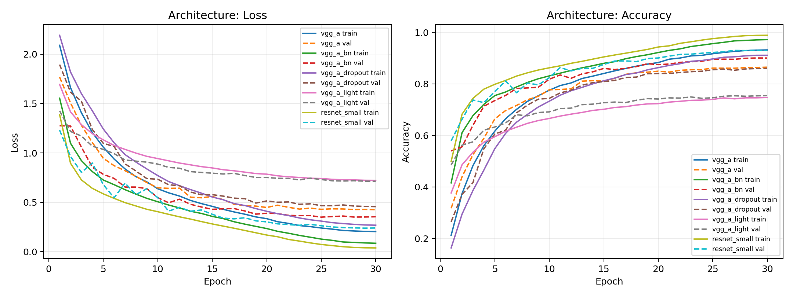

#### 分析

1. **ResNet_Small 表现最好（93.03%）**：残差连接有效缓解了深层网络的梯度消失问题，配合 BN 使训练非常稳定。
2. **BN 的效果显著**：同样的 VGG-A 结构，加 BN 后从 86.47% 提升到 90.05%，提升约 4 个百分点。
3. **Dropout 的效果有限**：VGG_A_Dropout（86.03%）与 VGG_A（86.47%）接近。在 30 epoch 的训练中，Dropout 的正则化效果还未充分体现。
4. **轻量网络容量不足**：VGG_A_Light 只有 285K 参数，网络容量有限，准确率只有 75.45%。

#### 调试过程

在初始实验中，VGG_A 和 VGG_A_Dropout 使用 Adam (lr=1e-3) 时完全无法收敛（准确率停留在 10%，即随机猜测）。分析原因：

- 深层网络（8 层卷积）在没有 BN 的情况下，较高的学习率会导致梯度爆炸
- Adam 的自适应学习率在这种情况下反而不如 SGD + momentum 稳定

解决方案：将非 BN 深层网络改用 SGD (lr=0.01, momentum=0.9)，成功收敛。同时发现 VGG_A_Dropout 原始代码缺少权重初始化，补上 Xavier 初始化后训练正常。

### 1.5 训练速度对比

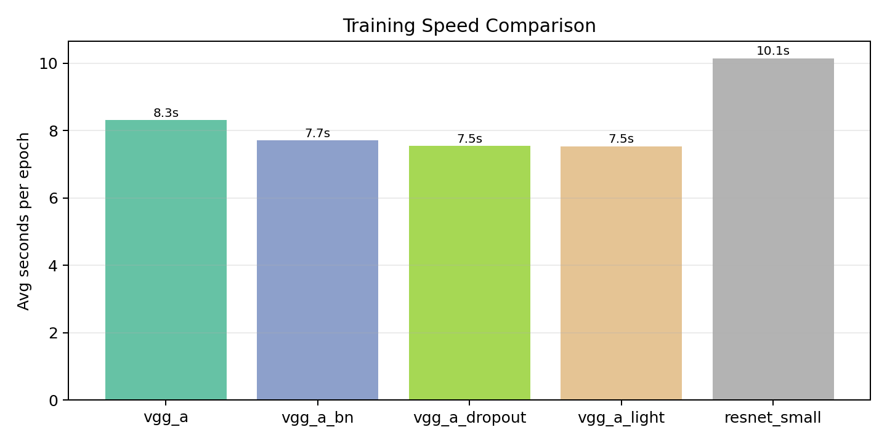

ResNet_Small 由于结构更复杂（残差连接），每 epoch 耗时最长（10.1s）。VGG_A_Light 最快（7.5s），但准确率也最低。综合性价比来看，VGG_A_BatchNorm 在速度和准确率之间取得了较好的平衡。

### 1.6 不同优化器对比

在 VGG_A_BatchNorm 上对比三种优化器：

| 优化器 | 学习率 | 最佳验证准确率 |
|--------|--------|--------------|
| **Adam** | 1e-3 | **90.05%** |
| AdamW | 1e-3 | 89.71% |
| SGD | 0.01 | 88.63% |

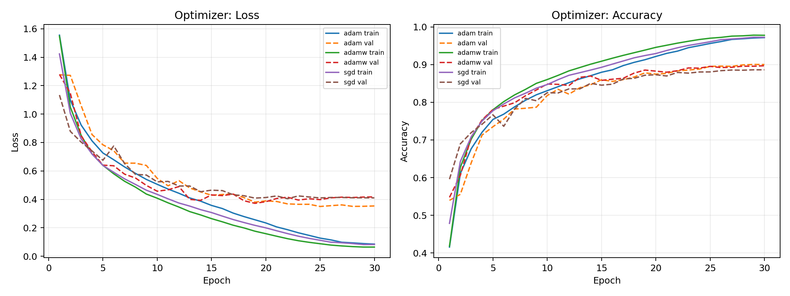

Adam 和 AdamW 表现接近，SGD 略低。Adam 的自适应学习率在有 BN 的网络上表现良好。AdamW 的解耦权重衰减在本实验中没有带来明显优势，可能是因为训练轮数较少。

### 1.7 不同激活函数对比

在 VGG_A_BatchNorm 上对比三种激活函数：

| 激活函数 | 最佳验证准确率 |
|---------|--------------|
| **ReLU** | **90.05%** |
| LeakyReLU | 89.84% |
| ELU | 87.35% |

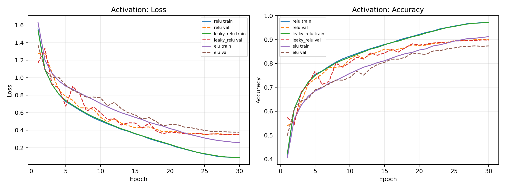

ReLU 和 LeakyReLU 表现接近，ELU 略低。在有 BN 的网络中，ReLU 的"死神经元"问题被 BN 的归一化缓解了，因此 LeakyReLU 的优势不明显。

### 1.8 不同损失函数对比

| 损失函数 | 最佳验证准确率 |
|---------|--------------|
| **CE + Label Smoothing (0.1)** | **90.13%** |
| CrossEntropy | 90.05% |
| Focal Loss (γ=2) | 88.48% |

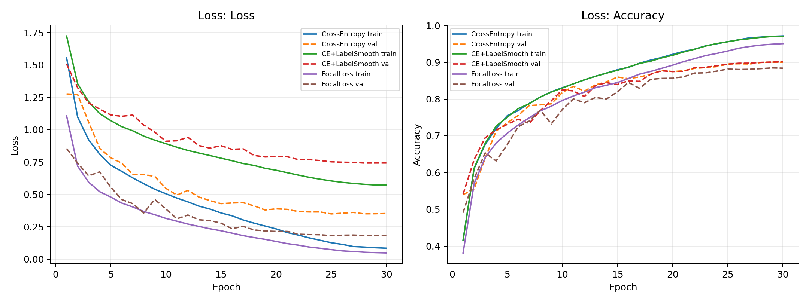

Label Smoothing 带来了微小的提升（0.08%），通过软化标签防止模型过度自信。Focal Loss 设计用于处理类别不平衡问题，在 CIFAR-10 这种均衡数据集上反而降低了性能。

### 1.9 梯度范数分析

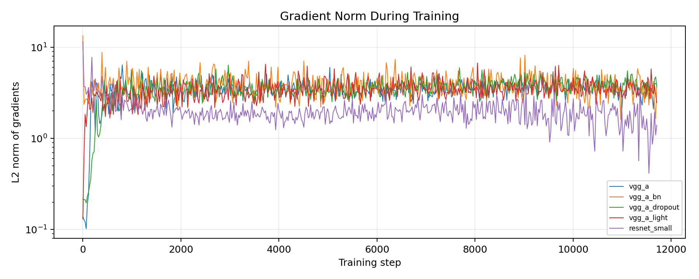

从梯度范数图可以观察到：
- ResNet_Small 的梯度最稳定，波动最小
- VGG_A_BatchNorm 的梯度也比较平稳
- 无 BN 的 VGG_A 梯度波动较大

### 1.10 卷积核可视化

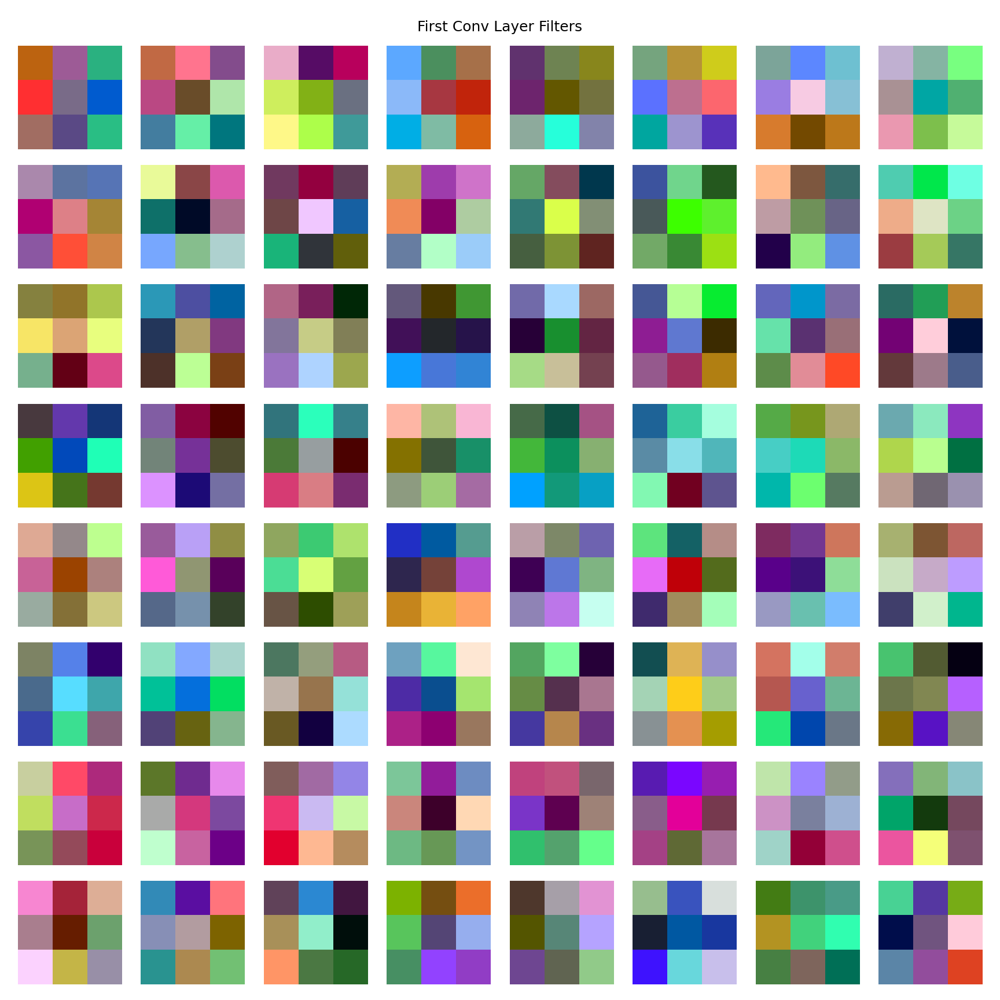

第一层卷积核学到了边缘检测、颜色检测等基础特征，这与视觉神经科学中 V1 区域的简单细胞响应一致。

### 1.11 BN 允许更高学习率

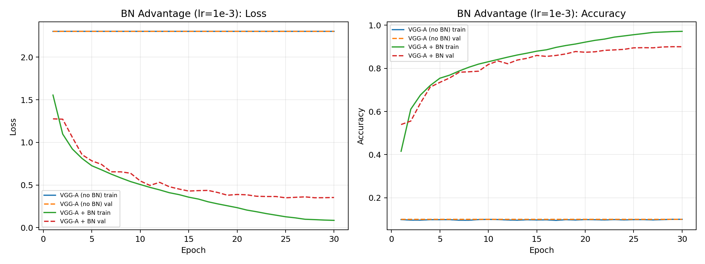

在 lr=1e-3 下，VGG_A+BN 正常训练到 90%，而 VGG_A 完全无法收敛（10%）。这直观地展示了 BN 的核心优势：允许使用更高的学习率，加速训练收敛。

---

## 二、任务二：Batch Normalization 分析（30%）

### 2.1 BN 算法简述

Batch Normalization 对每个通道 $c$ 的激活值进行归一化：

$$O_{b,c,x,y} \leftarrow \gamma_c \frac{I_{b,c,x,y} - \mu_c}{\sqrt{\sigma_c^2 + \epsilon}} + \beta_c$$

其中 $\mu_c$ 和 $\sigma_c$ 是当前 mini-batch 在通道 $c$ 上的均值和标准差，$\gamma_c$ 和 $\beta_c$ 是可学习的仿射参数。

### 2.2 VGG-A 与 VGG-A+BN 性能对比

#### 实验设置

- VGG-A: Adam, lr=1e-4（更高的 lr 无法收敛）
- VGG-A+BN: Adam, lr=1e-3（BN 允许 10 倍高的学习率）
- 训练 20 epochs，Cosine Annealing 调度

#### 结果

| 模型 | 学习率 | 最佳验证准确率 |
|------|--------|--------------|
| VGG-A | 1e-4 | 78.31% |
| **VGG-A + BN** | **1e-3** | **89.34%** |

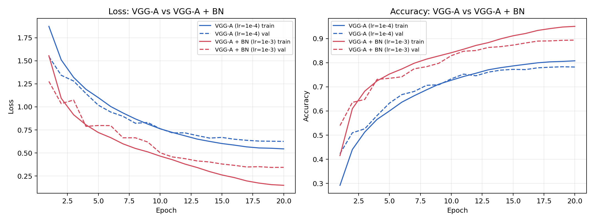

BN 模型不仅最终准确率更高（+11%），而且收敛速度更快。在第 5 个 epoch 时，BN 模型已经达到了 VGG-A 最终的准确率水平。

### 2.3 Loss Landscape 分析

#### 方法

为了测试 BN 对 loss 稳定性的影响，我们用不同学习率训练同一模型，记录每步的 batch loss，然后取所有学习率下的 min/max 包络线。包络线越窄，说明 loss landscape 越平滑。

- VGG-A 学习率: [1e-5, 5e-5, 1e-4, 5e-4, 1e-3]
- VGG-A+BN 学习率: [1e-4, 5e-4, 1e-3, 2e-3, 5e-3]

注意 BN 模型可以使用更高的学习率范围。

#### 结果

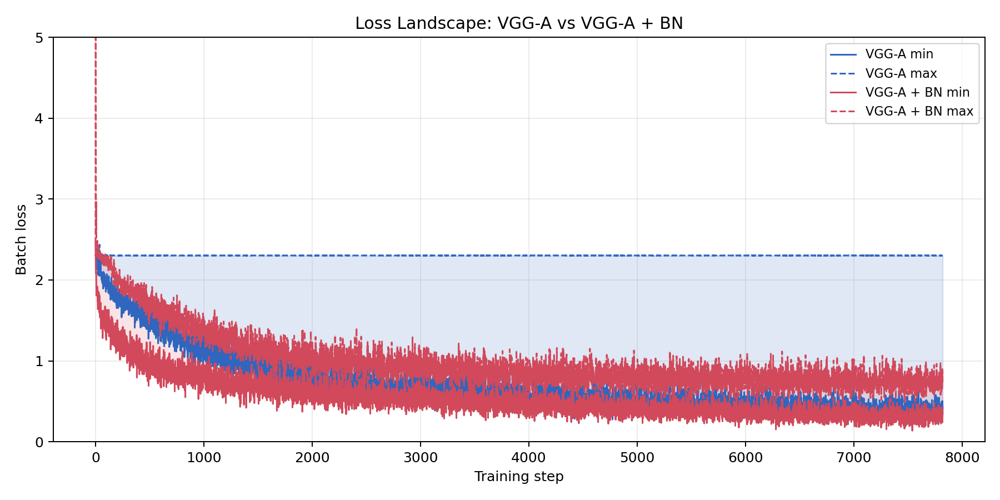

从图中可以清楚看到：
1. **VGG-A+BN 的 loss band 更窄**：不同学习率下的 loss 变化范围更小，说明优化 landscape 更平滑
2. **VGG-A+BN 收敛更快**：loss 下降速度明显更快
3. **VGG-A 的 loss 波动更大**：尤其在训练初期，不同学习率导致的 loss 差异很大

### 2.4 Gradient Predictiveness 分析

#### 方法

Gradient predictiveness 衡量的是：在当前点的梯度方向上走一步后，梯度的变化有多大。具体地，在训练步 $t$，计算：

$$\text{Gradient Predictiveness} = \|\nabla L(x_t + \eta \nabla L(x_t)) - \nabla L(x_t)\|$$

如果这个值小，说明梯度在局部是"可预测的"，即 loss landscape 是平滑的，一阶优化方法（如 SGD）的局部线性近似更准确。

#### 结果

| 模型 | 平均 Gradient Predictiveness | 平均 β-Smoothness |
|------|---------------------------|------------------|
| VGG-A | 33.74 | 3374 |
| **VGG-A + BN** | **18.63** | **1863** |

改善幅度：**45%**

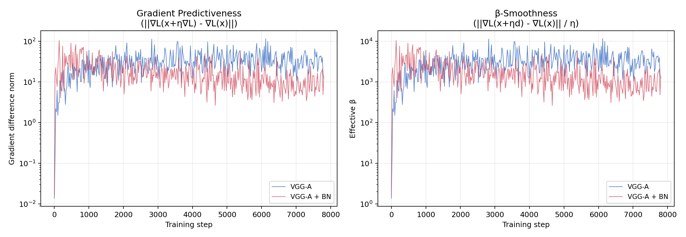

#### 分析

1. **BN 显著降低了梯度变化**：VGG-A+BN 的 gradient predictiveness 比 VGG-A 低 45%，说明 BN 使得 loss landscape 更加平滑。
2. **β-Smoothness 更低**：β-smoothness 衡量的是 loss 函数的 Lipschitz 常数的上界。BN 模型的 β 值更低，意味着梯度变化更加有界，优化更稳定。
3. **这解释了为什么 BN 允许更高的学习率**：更平滑的 landscape 意味着更大的步长不会导致"跳过"最优解。

### 2.5 总结：BN 为什么有效

通过实验，我们验证了 Santurkar et al. (2018) 的核心结论：

> BN 通过重参数化使优化 landscape 显著更平滑。

具体表现为：
1. **允许更高学习率**：BN 模型可以用 10 倍高的 lr 而不发散
2. **更快收敛**：相同 epoch 数下，BN 模型准确率高 11%
3. **更平滑的 loss landscape**：min/max band 更窄
4. **更可预测的梯度**：gradient predictiveness 降低 45%
5. **更低的 β-smoothness**：优化更稳定

---

## 三、代码结构

```
codes/VGG_BatchNorm/
├── models/vgg.py          # 模型定义（VGG_A, VGG_A_BatchNorm, VGG_A_Dropout, VGG_A_Light, ResNet_Small）
├── data/loaders.py        # CIFAR-10 数据加载
├── utils/nn.py            # Xavier 权重初始化
├── task1_train.py         # 任务一实验脚本
├── task2_bn.py            # 任务二实验脚本
└── reports/
    ├── figures/           # 所有实验图表
    ├── models/            # 模型权重 (.pt)
    └── results/           # CSV 训练历史 + JSON 汇总
```

### 运行方式

```bash
cd codes/VGG_BatchNorm
pip install torch torchvision tqdm matplotlib numpy

# 任务一：全部实验
python task1_train.py --mode all --epochs 30 --num-workers 4 --use-cosine-schedule

# 任务二：BN 分析
python task2_bn.py --mode all --epochs 20 --num-workers 4
```

---

## 参考文献

1. Krizhevsky, A. (2009). Learning Multiple Layers of Features from Tiny Images. Technical Report.
2. Simonyan, K., & Zisserman, A. (2015). Very Deep Convolutional Networks for Large-Scale Image Recognition. ICLR.
3. Ioffe, S., & Szegedy, C. (2015). Batch Normalization: Accelerating Deep Network Training by Reducing Internal Covariate Shift. ICML.
4. Santurkar, S., Tsipras, D., Ilyas, A., & Madry, A. (2018). How Does Batch Normalization Help Optimization? NeurIPS.
5. He, K., Zhang, X., Ren, S., & Sun, J. (2016). Deep Residual Learning for Image Recognition. CVPR.
